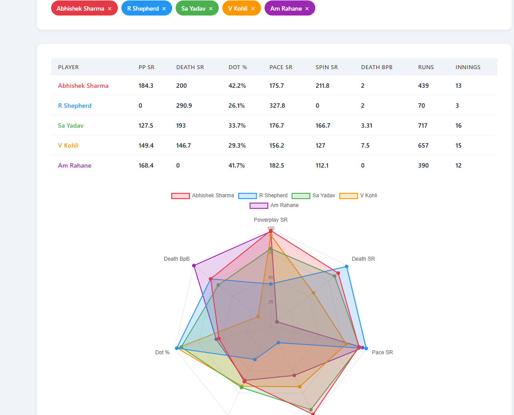
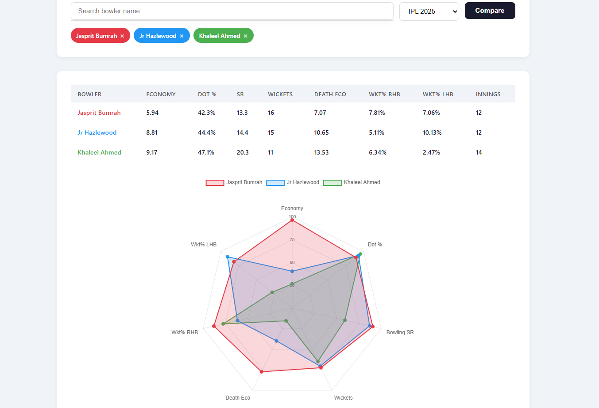

# CricMB

CricMB is a simple tool to compare IPL players using ball-by-ball match data.

It shows how players perform in different situations, not just overall numbers. The idea is to make comparison easier and more meaningful
Instead of only looking at stats like average or total runs, CricMB highlights important match skills like scoring speed, dot ball control, wicket taking ability, and performance in different phases of the innings.

---

## How it shows performance

Player performance is converted into percentiles so comparison becomes simple.
Higher percentile means the player performs better compared to other IPL players.

Example:

* high percentile → strong skill
* average percentile → normal performance
* low percentile → weaker area

---

## Visual comparison

Performance is displayed using a spider (radar) chart.
Each axis represents an important skill area.

For batters this can include:

* Total runs
* dot ball %
* boundary hitting
* performance vs spin
* performance vs pace
* powerplay scoring
* death overs scoring

For bowlers this can include:

* economy
* dot ball %
* wickets taken
* powerplay wickets
* death overs economy
* performance vs right hand batters
* performance vs left hand batters

This makes it easy to quickly compare two players and understand their strengths.

## Example Comparisons

### Batter comparison (radar chart)
Shows strengths across strike rate, dot ball %, boundary %, performance vs spin and pace.

### Bowler comparison (radar chart)
Shows economy, dot ball %, wicket taking ability, powerplay and death overs performance.

---

Currently this is a basic version focused only on IPL data comparison.
